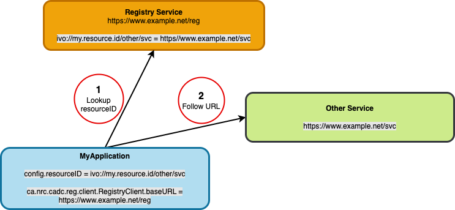
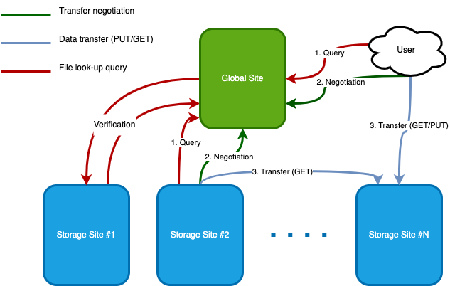
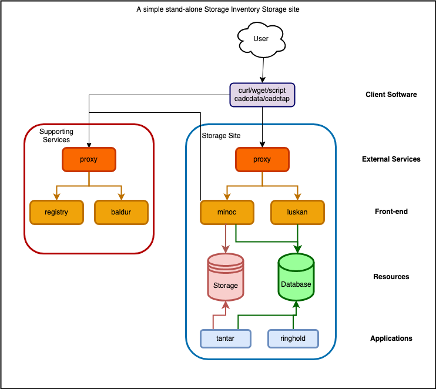
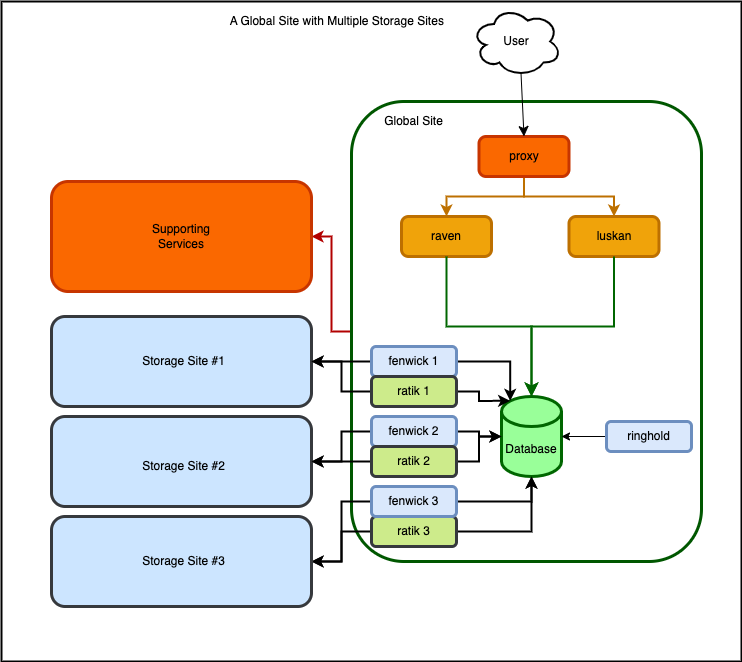
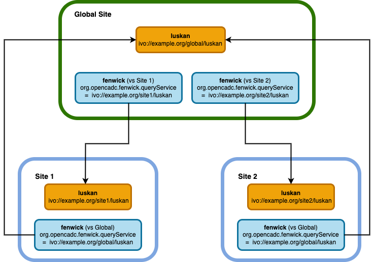
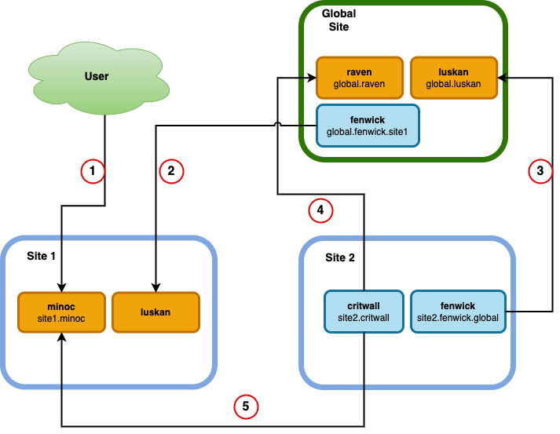
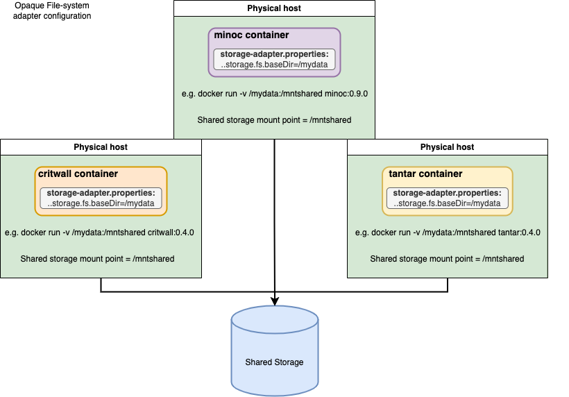

# CADC Storage Inventory Architecture and Deployment

## Introduction
### Storage Inventory Terms and Concepts
<a id='term-artifact'>**artifact**</a>  
A representation of a file and its metadata in the SI database, specifically the _inventory.Artifact_ table (see the [SI data model](https://github.com/opencadc/storage-inventory/tree/master/storage-inventory-dm)).  The term _artifact_ is often used to refer to both the database representation of a file and the file itself as one thing, but when an SI application is acting on an _artifact_, it specifically refers to the database.
- ➡️ an artifact _URI_ is a unique idenitfier for a file (or object) stored in SI.  The last path component of a _URI_ is always the _filename_.

<a id='term-bucket'>**bucket**</a> 
SI assigns a `bucket` label to files on storage and to artifacts in the inventory database. 
- Some SI applications can work on subsets of buckets, allowing some degree of parallelization.
- Buckets labels are represented by hex strings, e.g. `a74`.
- Although the bucket label of a file can also refer to the location of the file on storage, the two are not necessarily related.  On a storage platform that uses the concept of buckets (e.g. Swift), a file's bucket label is currently used as part of the storage platform's bucket, but this is just an optimization; on a POSIX file-system, the bucket will be parsed into subdirectories (e.g. /a/7/4/).
- When applications refer to buckets in the inventory database, they are refering to the _inventory.Artifact.uriBucket_ column in the database.  This column is populated with a random hex string on artifact creation.
- ❗ _storage_ buckets and _uri_ buckets are not the same thing, e.g. files in _storage_ bucket `04c` are not necessarily the same as artifacts in _uri_ bucket `04c`.

<a id='term-namespace'>**namespace**</a>  
A _namespace_ is an SI identifier for a collection of artifacts, and can be used to define the logical structure of data within SI.  For example, `cadc:CFHT/` might be used to identify all CFHT files held at the CADC; `cadc:CFHT/raw/` might be used to identify all of the raw CFHT files held at the CADC -- both `cadc:CFHT/` and `cadc:CFHT/raw/` are _namespaces_ but they identify different scopes of CFHT artifacts.  SI services and applications often act on namespaces defined using regex patterns -- such as during file replication and determining access permissions -- so some thought must be put into what is used.  See the [SI data model page](https://github.com/opencadc/storage-inventory/tree/master/storage-inventory-dm) for more detail on the concepts of _URI_ and _namespace_.
- A namespaces is defined part of an artifact URI that ends in `:` or `/`.
    - ❗A namespace must always end at a delimiter to avoid confusion with other namespaces (e.g. cadc:TEST and cadc:TESTDATA, instead of cadc:TEST/ and cadc:TESTDATA/).
- the URI for an artifact is '_namespace/filepath_'.  A _namespace_ which includes an artifact can include any delimited path defined by the artifact's URI, e.g. all of the following are namespaces which include the artifact `cadc:TEST/data/raw/example/test1.fits`:
    - `cadc:`
    - `cadc:TEST/`
    - `cadc:TEST/data/`
    - `cadc:TEST/data/raw/`
    - `cadc:TEST/data/raw/example/`
- ❗ A _URI_ which has a _filepath_ of just the _filename_ (e.g. `cadc:test1.fits`) is not recommended.
    -  It is possible to have files with the same name, as long as they are in different namespaces.
- The part of the namespace preceding the `:` is referred to as the 'scheme' elsewhere in the documentation.  This part of the namespace usually refers to an organization (e.g. `cadc:DAO`, `mast:JWST`)

<a id='term-resourceid'>**resourceID**</a>  
This is an unique ID for a deployed service. A [`registry`](#configuration-registry) service provides a look-up to translate these IDs into service URLs.  Example: `ivo://opencadc.org/minoc`, which might resolve to `https://www.opencadc.org/minoc`.
- a `resourceID` is a label which identifies a service in an abstract way.
    - ➡️ Service locations could change, but resourceIDs should not.
- `resourceIDs` may be shared within a site -- used by local services and applications -- but may also be shared across an _organization_.  Because the scope of a site's resourceIDs could be broad, some thought needs to be put into their definition.
- the `ivo:` scheme in the `resourceID` means that the `registry` service that will be used to resolve the `resourceID` complies with the [**IVOA** registry standard](https://www.ivoa.net/documents/RegistryInterface/).  The available CADC [`reg`](https://github.com/opencadc/reg/tree/master/cadc-registry-server) service is an example of an **IVOA** registry implementation.
<center>

</center>


### Storage Inventory Resources
<a id='resource-repository'></a>
#### Container Image Repository  
- URL: https://images.opencadc.org
- This is an OCI compliant image repository, so images can be downloaded using the standard URL format: `https://images.opencadc.org/<project>/<image>:<tag>`, where the list of projects, images, and tags can be found using the commands below.  Images specific to Storage Inventory will be found in the `storage-inventory` project, although images for supporting services may be in other projects (i.e. in `core`).
- To see what projects are hosted here, use ([`jq`](https://stedolan.github.io/jq/) is a helpful command for parsing JSON): 
```
curl -s https://images.opencadc.org/api/v2.0/projects | jq '[.[].name] | sort'
```
- To see what images are available in a project, use (e.g., for storage-inventory):
```
curl -s https://images.opencadc.org/api/v2.0/projects/storage-inventory/repositories | jq '[.[].name] | sort'
```
- To see what version tags are available for an image, use (e.g., for storage-inventory/minoc):
```
curl -s https://images.opencadc.org/api/v2.0/projects/storage-inventory/repositories/minoc/artifacts | jq '[.[].tags | select (. != null) | .[].name] | sort'
```
- A note on image tags: 
    - image tags will look like _version_ (e.g. `0.9.0`) or _version-datetimestamp_ (e.g. `0.9.0-20230217T201656`)  
    - The datetimestamp is a build identifier -- the image with the a plain version number (0.9.0 in the example given) will be the same image as the image with the _same version number and the **latest** build identifier_.
    - for a version of `x.y.z`:
        - `x` will change with major releases -- functionality, api, and configuration may change and break earlier configuration.
        - `y` will change with minor releases -- minor non-breaking or backwards-compatible feature or configuration changes.
        - `z` will change with minor bug fixes -- otherwise compatible with current version features and configuration.

#### Other Documents
- [High-level overview](https://github.com/opencadc/storage-inventory/tree/master/docs)
- [Data model](https://github.com/opencadc/storage-inventory/tree/master/storage-inventory-dm)


## Overview of Storage Inventory
### System Architecture
**Storage Inventory** consists of the components that make up one or more _Storage sites_ and a _Global site_.  A Storage site can exist on its own, as a mechanism for maintaining a structured inventory of files.  A Global site is required when there are two or more Storage sites which need to be synchronized; it also provides a single site for users to go to find all available copies of a file. A detailed description of the data model, features and limitations can be found [here](https://github.com/opencadc/storage-inventory/tree/master/docs).

<center>

</center>

In general:
- A _Storage_ site is never configured to have knowledge of another _Storage_ site.
- A _Storage_ site discovers artifacts which it should have by querying the _Global_ site.  The _Storage_ site then uses the artifact metadata (specifically the artifact URI) to query the _Global_ site for URLs to the files corresponding to those artifacts and downloads them.
- A _Storage_ site will validate the contents of its physical storage against the contents of the _inventory_ database.
- A _Global_ site queries each _Storage_ site for files that they have, and files that have been removed, so it maintains a unified global record of all artifacts within a Storage Inventory deployment.


### Standalone Storage Site
A Storage site maintains an inventory of the files stored at a particular location, and provides mechanisms to access (**minoc**) those files and query (**luskan**) the local inventory. 
Below is an outline of a stand-alone (no _Global_ site) Storage Inventory _Storage_ site, with one storage system, one database, etc, in one data centre. If you have files in multiple data centres, or more than one storage platform in one data centre (e.g. some files on a posix file-system and some on Ceph object storage), you would 
have more than one Storage site, and each site would run its own services, database, storage, and applications.  


<center>

</center>

A standalone Storage Inventory Storage site will consist of following:
- Front-end Web services:
    - A **File service** ([`minoc`](#configuration-minoc)): provides a REST based file service that supports HEAD, GET, PUT, POST, DELETE operations.
    - A **Query service** ([`luskan`](#configuration-luskan)): provides a Web Service for querying artifact metadata contained in the Inventory database, using the [`IVOA Table Access Protocol`](https://www.ivoa.net/documents/TAP/) (TODO: Replace TAP link with user document, not reference to spec....)
- Resources:
    - An **Inventory database**: this is the ledger tracking all the files storage at the site. Applications and services will access this database in parallel so it will need to have good performance, especially as the content at the site grows.  Currently only [Postgresql](https://www.postgres.org) is supported.
    - A **Storage platform**: the storage platform on which file will be stored. Currently, SI supports two types of storage: POSIX-compliant file-systems (e.g. Lustre) and Swift API compatible Object Store (e.g. Ceph Object Store)
        - SI services and applications interact with the back-end storage using a _Storage Adapter_:
            - [POSIX filesystem adapter](#POSIX)
            - [Swift Object Store adapter](#Swift)
- Applications:
    - A **File validation application** ([`tantar`](#configuration-tantar)): Artifact validation application that compares the inventory database with the contents of the back-end storage.
    - An **artifact removal tool** ([`ringhold`](#configuration-ringhold)): Removes the local copy of artifacts. Use with caution: essentially the same as `\rm -r` on a [_namespace_](#term-namespace) at a storage site.
- Supporting Infrastructure and Services:
    - A **proxy/ingress** service: All the calls the front-end Web services need to go through a proxy/ingress that provides SSL termination and ensures that authentication headers are correctly set before being routed to the actual service. The proxy needs a public IP address and a valid SSL certificate (e.g. [Let's Encrypt](https://www.letsencrypt.org)).  This proxy service might be an external load balancer (e.g. [haproxy](www.haproxy.org)) or an ingress in your container orchestration system -- the details will vary depending on your deployment environment.  Whichever proxy or ingress is chosen, it must support x509 client proxy certificates.
        - ➡️ Note: although the diagram above shows a separate proxy for Storage site services and supporting services, this might not be necessary on all infrastructure.
    - A [`Registry`](#configuration-registry) service: Used to map [_resourceIDs_](#term-resourceid) to the actual URLs where the service is deployed.  Client software, services, and applications will use a registry to look up the locations of services. The linked `cadc-registry-server` is provided as an example implementation.
    - A **Permissions services** ([`baldur`](#configuration-baldur)): permissions service which uses configurable rules to grant access based on resource identifiers (_Artifact.uri_ values or [_namespaces_](#term-namespace)).
    This service is required if Authentication and Authorization (A&A) is required for the SI deployment. Generally, **baldur** works along with a Group Membership Service (GMS) and/or User Service.
    - A **Group Membership Service** (`GMS`): .  Needed for providing the [IVAO group membership look-up API](https://github.com/ivoa-std/GMS) used by `baldur` and other services when determining access permissions.  For an example implementation, built on top of [Indigio IAM](https://indigo-iam.github.io/v/current/), see https://gitlab.com/ska-telescope/src/group-membership-service (more implementation details to follow).

### Global Site with Multiple Storage Sites

<center>

</center>

If you need to replicate files among multiple Storage Sites, you will need a Global Site.  The Global site maintains a view of all Storage sites, allowing individual Storage sites to discover files that they need to copy.  This also provides a single site which users can query to find files, rather than having to know about and search individual Storage sites.

A Global site will be required different services than a Storage site, and both Storage sites and Global sites will need to run additional applications to synchronize metadata and files.

- Front-end Web services:
    - A **File locator service** ([`raven`](#configuration-raven)): provides a REST-based service that returns all locations of a file, as they appear in the Global inventory database.
    - A **Query service** ([`luskan`](#configuration-luskan)): this is the same service, and is configured the same way as for a Storage site.
- Resources:
    - An **Global Inventory database**: this is basically identical to a Storage site inventory database, except there is additional information regarding where each file is located.
    - ➡️ A Global site does not require file storage.
- Applications:
    - both Storage sites and Global site will need a **Metadata synchronization** application ([fenwick](#configuration-fenwick)) -- a Storage site will only need to run one instance of `fenwick` but a Global site will need to run an instance of `fenwick` for each Storage site it needs to track.  See the [Metadata synchronization](#metadata-synchronization) description below.
    - both sites will also need to periodically run a **Metadata validation** application ([ratik](#configuration-ratik)) -- similar to `fenwick` a Storage site will only need to run one instance of `ratik` but a Global site will run an instance of `ratik` for each Storage site it is tracking.
    - a **File synchronization** application ([critwall](#configuration-critwall)) -- only Storage sites will need to run this application.  It will query the local inventory database for artifacts which do not have assocated files in local storage, query the Global `raven` service for the locations of those files, and download them to the local storage.  See the [File synchronization](#file-synchronization) description below.

#### Metadata synchronization

<center>

</center>

#### File synchronization

<center>

</center>

1. User PUTs a file to the `site1.minoc` service, either directly or via negotiation with a global [`raven`](#configuration-raven) service.
1. `global.fenwick.site1` discovers the new inventory metadata for the file by querying `site1.luskan`.
1. `site2.fenwick.global` discovers the new inventory metadata for the file by querying `global.luskan`.
1. `site2.critwall` finds the locations of the new file via `global.raven` -- this returns a list of URLs from which the file can be downloaded.
1. `site2.critwall` downloads the file from `site1.minoc`.

     
## Client Software
Generic HTTP client tools such as [`curl`](https://curl.se) or [`wget`](https://www.gnu.org/software/wget/) can be used to interact with the SI, however multi-step operations such as transfer negotiations or transfer of large files with
SI transactions might require dedicated scripts.  (TODO provide examples of usage)

Alternatively, the CADC maintains Python client applications/libraries that can be used with the SI:
- [`cadcdata`](https://pypi.org/project/cadcdata/) - for file operations with **minoc** and **raven**. That includes transfer negotiations, file uploads, downloads or deletes. Or simply file information. The package takes advantage of
     the SI features to offer robust and fault tollerant transfer of files small or large.
- [`cadctap`](https://pypi.org/project/cadctap/) - for querying the artifact metadata. It works with a **luskan** service delopyed at a site or the global one. Alternatively, any generic TAP-based tool can be used to query **luskan** including (but not limitted to) [`PyVO`](https://pypi.org/project/pyvo/)

The [`CADC Direct Data Service`](https://www.cadc-ccda.hia-iha.nrc-cnrc.gc.ca/en/doc/data/) presents a variety of scenarios for accessing the CADC SI using generic and specific client tools. 


## Deployment Prerequisites
### Hardware Requirements
Database:
- Required for: Storage site and Global site
- storage: about 1KB/artifact (storage site) or 1.5KB/artifact (global site) for data and indices.
- RAM/CPU: For a site with 200 million artifacts, 20 cores with 180GB RAM and NVMe storage gives sufficient performance.
- PG 12.3 or newer 

Storage platform:
- Required for: Storage site only
- Ceph Object store (version 14 or greater)

    **OR**

- POSIX file-system.

Worker nodes:
- SI applications and services don't consume a lot of memory (~1GB-4GB per instance) although some (minoc, critwall) are multithreaded and can take advantage of multiple cores.
- In a production setting it would be best not to mix services and applications on the same nodes in order to ensure that service quality isn't affected by things like metadata validation. A single node might suffice in a test deployment whereas you'll need several nodes for a production deployment.

### Software Requirements
- container images are all OCI-compliant (produced with docker cli), so should run in any compatible environment.
- orchestration software: A simple, single node test deployment example will be provided.  Deployment within different orchestration environments (e.g. Docker Swarm, Kubernetes) are beyond the scope of this document (maybe we can provide helm charts eventually...?)
- [`haveged`](https://www.issihosts.com/haveged/) (or other entropy-generating service) this is only necessary on hosts running the services. 
     

## Deployment 
**Note on logging:** Storage inventory services and application containers all log to `stdout` by default -- for a production deployment, these should be captured and preserved by whatever mechanism is available on your system.

1. <a id='configuration-storage-adapter'>**Storage Adapters**</a>

    - Required for: Storage site only
    - Required by: [critwall](#configuration-critwall), [minoc](#configuration-minoc), and [tantar](#configuration-tantar)
    - How to configure your storage is dependent upon your local hardware and data centre details.  However -- 
        - Currently, there are two types of storage supported, each of which requires a _storage adapter_ and associated configuration files:
            - [POSIX file-system](https://github.com/opencadc/storage-inventory/tree/master/cadc-storage-adapter-fs) <a id='POSIX'></a>
                - for POSIX storage, the storage file-system will need to be mounted directly into the containers (e.g. a 'volume' path in Docker or a PVC in kubernetes).  Since the storage will be mounted by several containers, it will need to be a _shared_ file-system which supports writes from multiple hosts. 
                - ❗<a id='note-on-uid'>NOTE:</a> the services in the containers run as a user with a UID:GID of 8675309:8675309.  This user must be allowed to read and write files on the configured file-system.  This is usually done by ensuring a _non-privileged_ (or even 'nologin') user is configured on your system with this UID:GID.

                    <center>
                    
                    </center>

                - in the `cadc-storage-adapter-fs.properties` configuration file for POSIX storage :
                   
                    - the `org.opencadc.inventory.storage.fs.baseDir` parameter must point to the location that the storage is mounted _inside the container._  For example,
                        ```
                        docker run --user tomcat:tomcat -v /path/on/host:/mountpoint/in/container minoc:0.9.2
                        ```
                        or
                        ```
                        apiVersion: app/v1
                        kind: deployment
                        <...snip....>
                        volumeMounts:
                            - mountPath: "/mountpoint/in/container"
                            name: lustre-volume
                        securityContext:
                            runAsUser: 8675309
                            runAsGroup: 8676309
                        volumes:
                            - name: lustre-ceph-volume
                                hostPath:
                                path: /path/on/host
                                type: Directory
                        ```
                    - the `org.opencadc.inventory.storage.fs.OpaqueFileSystemStorageAdapter.bucketLength` sets the _depth_ of the directory tree created to store files.  At each node in the tree, 16 hex (0-f) directories are created -- a `bucketLength` of 2 will create 16 directories (0-f) each with sixteen subdirectories (0-f) -- only the 256 (16x16) subdirectories at the bottom of the tree will be used to store files.   For efficiency of validation, you should choose a `bucketLength` which results in only a few thousand files in each directory. e.g, for a `bucketLength=3` and `baseDir = /mount/in/container`:
                        ```
                        [container]$ ls -F /mount/in/container/
                        0/ 1/ 2/ 3/ 4/ 5/ 6/ 7/ 8/ 9/ a/ b/ c/ d/ e/ f/         # Depth=1/3
                        [container]$ ls -F /mount/in/container/a/
                        0/ 1/ 2/ 3/ 4/ 5/ 6/ 7/ 8/ 9/ a/ b/ c/ d/ e/ f/         # Depth=2/3
                        [container]$ ls -F /mount/in/container/a/7/
                        0/ 1/ 2/ 3/ 4/ 5/ 6/ 7/ 8/ 9/ a/ b/ c/ d/ e/ f/         # Depth=3/3
                        [container]$ ls -F /mount/in/container/a/7/4/
                        test0001.fits test0002.fits test0003.fits test0004.fits test0005.fits
                        ```
                    - in the above example the 'bucket' is the directory path: `a74`, and there will be a total of 4096 (16x16x16) buckets.
                    - **Note:** as you can see, the currently implemented version of this storage adapter is the 'OpaqueFileSystem' adapter -- the structure of subdirectories is not something which can easily be mounted and used elsewhere.  It would be possible to develop a filesystem adapter which provides a human readable directory structure.
            - [Swift Object Store API](https://github.com/opencadc/storage-inventory/tree/master/cadc-storage-adapter-swift) (e.g. CEPH Object Store)<a id='Swift'></a>
                - for Swift storage, the Ceph gateway URL must be reachable from inside the containers.
                - in the `cadc-storage-adapter-swift.properties` configuration file for Swift storage:
                    - `org.opencadc.inventory.storage.swift.SwiftStorageAdapter.bucketLength` sets the number of hex characters in the configured buckets (e.g. `a74`), and the total number of buckets (i.e. a `bucketLength` of 3 will create 16^3 (4096) buckets).  Configure the `bucketLength` so the expected number of files per bucket is no more than a few thousand.
    - Whichever storage you use, it must be directly available to certain Storage Inventory services and applications.  These are:
        - **minoc** -- this service will write files to and retrieve files from storage.
        - **critwall** -- only required in a Storage Inventory deployment with more than one Storage site and a Global site.  This application will scan the site inventory database for artifacts with metadata but no associated local file copy in storage, then negotiate the transfer of those files with the Global site **raven** service.
        - **tantar** -- this application verifies the content of the storage system against the inventory database, so will need to read files from the storage.


1. <a id='configuration-database'>**Database**</a>

    - Required for: Storage site and Global site
    - Required by: [critwall](#configuration-critwall), [fenwick](#configuration-fenwick), [luskan](#configuration-luskan), [minoc](#configuration-minoc), [ratik](#configuration-ratik), [raven](#configuration-raven), [ringhold](#configuration-ringhold), [tantar](#configuration-tantar)
    - The database will be accessed by all local SI site services and applications, so must be reachable from wherever you deploy your containers for that site.
    - Storage Inventory services have been tested with postgres 12.3.  Newer versions will likely work as well.
    - As the content in the database grows, you'll need to think about its storage requirements.  For the PG data and indices, this is roughly 1KB/artifact (storage site) or 1.5KB/artifact (global site)
    
    1. In the following, the database being created is called `si_db`, but you can change that name as you see fit.  Whatever you choose, it will need to be referenced in the service and application configuration.
        - Initialize the database: `initdb -D /var/lib/postgresql/data --encoding=UTF8 --lc-collate=C --lc-ctype=C`
        - You might need to change the data location (`-D`), depending on your postgres installation and hardware layout.
    1. As the postgres user, create a file named [si.dll](si.dll) with the linked content, edit as appropriate, and run `psql -f si.dll -a`

        - This will create three users:
            - A TAP admin user (e.g. `tapadm`) - privileged user.  Manages the tap schema with permissions to create, alter, and drop tables. Used by:
                - **luskan**
            - A User TAP query user (e.g. `tapuser`) - unprivileged user.  Used by the `luskan` service to query the inventory database. Used by:
                - **luskan**
                - **raven**
            - An Inventory admin user (e.g. `invadm`) - privileged user. Manages the inventory schema with privileges to create, alter, and drop tables, and is also used to insert, update, and delete rows in the inventory tables. Used by:
                - **critwall**
                - **fenwick**
                - **minoc**
                - **ratik**
                - **ringhold**
                - **tantar**
    - ❗ **NOTE:** The first service or application configured with the Inventory admin user to connect to the database will create and initialize the tables and indices using the above privileged user roles.
    - a basic example of a developer deployment of a compatible database can be found in [here](https://github.com/opencadc/docker-base/tree/master/cadc-postgresql-dev). (Except _pgsphere_ is not required...)

1. <a id='configuration-proxy'>**Proxy**</a>

    - Required for: Storage site and Global site
    - ❗x509 proxy certificates -- the longer certificate chain for these might not be supported by all balancers/proxies.  These proxy certificates are required for some A&A mechanisms.
        - **haproxy**
            - haproxy will need to be compiled against `openssl 1.0.2k` or a compatible version. Newer versions of `openssl` do not support proxy certificates.
            -  the environment variable `OPENSSL_ALLOW_PROXY_CERTS=1` needs to be set in the proxy environment.
            - a basic example of a developer deployment of a compatible instance of haproxy can be found [here](https://github.com/opencadc/docker-base/tree/master/cadc-haproxy-dev) and [here](examples/haproxy/haproxy.cfg).
        - **nginx**
            - untested, but likely has the same requirements and restrictions as haproxy for proxy certificates.
    - SSL termination -- although you will need to support https connections to your proxy, the SI containers do not accept https connections.  Because of this, your proxy must terminate the SSL connection and pass only non-SSL http connections to the containers.
    

1. <a id='configuration-registry'>**Registry service**</a>

    - Required for: Storage site and Global site (Note: could be the same registry instance for both)
    - Container image: Use the latest `core/reg` image from [`images.opencadc.org`](#resource-repository) or a different IVOA-compatible registry service.
    - See the [opencadc registry server](https://github.com/opencadc/reg/tree/master/cadc-registry-server) documentation for configuarion details.
    - [`resourceIDs`](#term-resourceid)
        - you will need to choose resourceIDs for services and resources that you deploy, and which need to be referenced by other services and applications.  For example, if your `minoc` service is available at the URL `https://www.example.org/minoc` and you choose a resourceID of `ivo://example.org/minoc`, the registry config for that resource (in the `reg-resource-caps.properties` file for the registry service) would look like:
        ```
                ivo://example.org/minoc = https://www.example.org/minoc
        ```
        This resourceID will appear in, for example, the `minoc.properties` file in the `minoc` service config:
        ```
                org.opencadc.minoc.resourceID = ivo://example.org/minoc
        ```
    - test with, e.g., `curl https://www.example.org/reg/resource-caps`

1. <a id='configuration-baldur'>**baldur**</a> - Permission service

    - Required for: Storage site and Global site (Note: would likely be the same baldur instance for both)
    - Container image: Use the latest `storage-inventory/baldur` image from [`images.opencadc.org`](#resource-repository)
    - See the [opencadc storage inventory baldur](https://github.com/opencadc/storage-inventory/tree/master/baldur) documentation for more configuration details.
    - Uses an IVOA compatible GMS service and configured [namespaces](#term-namespace) to determine file access permissions.
    - Configuration notes:
        - `baldur.properties`:
            - The `org.opencadc.baldur.allowedUser` x509 DN specified here is generally a 'service' user -- the services that call `baldur` need to be configured with this user's certificate.
                - in `minoc` and `raven` coniguration, this is the `cadcproxy.pem` file for these services.
            - The `org.opencadc.baldur.allowedGroup` is an IVOA GMS group [resourceID](#term-resourceid).  
                - The GMS service must be registered in the available Registry service.
                - the configured `readOnlyGroup` and `readWriteGroup` entries are also IVOA GMS group [resourceIDs](#term-resourceid).
    - test with, e.g., `curl https://www.example.org/baldur/availability`

1. <a id='configuration-gms'>**GMS**</a> - Group Membership service

    - Required for: Storage site and Global site (Note: could be the same gms instance for both)
    - TBD.  See the deployment and build documentation for this implementation built on top of [Indigio IAM](https://indigo-iam.github.io/v/current/): https://gitlab.com/ska-telescope/src/group-membership-service 

1. <a id='configuration-minoc'>**minoc**</a> - File service

    - Required for: Storage site only
    - Container image: Use the latest `storage-inventory/minoc` image from [`images.opencadc.org`](#resource-repository)
    - See the [opencadc storage inventory minoc](https://github.com/opencadc/storage-inventory/tree/master/minoc) documentation for details.
    - Configuation notes:
        - `minoc.properties`:
            - `org.opencadc.minoc.resourceID`:
                - this is the [_resourceID_](#term-resourceid) of _this_ instance of minoc, and will need to be configured in your registry.  It is used by the Global inventory as the location for artifacts at a site.
            - if you are using a [baldur](#configuration-baldur) service to manage file access permissions, you would put its _resourceID_ in `org.opencadc.minoc.readGrantProvider` and `org.opencadc.minoc.readGrantProvider`.  It is possible to have multiple instances of these providers, by specifing the `GrantProvider` options for each provider (each use of the option is _additive_ to the previous ones).
            - `org.opencadc.minoc.publicKeyFile`:
                - (optional) this is the public key specified in the [raven](#configuration-raven) configuration key `org.opencadc.raven.publicKeyFile`.
        - `catalina.properties` (from [cadc-tomcat config](https://github.com/opencadc/docker-base/tree/master/cadc-tomcat)):
            - the `org.opencadc.minoc.inventory.username` database account is the 'Inventory admin user' configured when creating the [database](#configuration-database)
    - when configuring the storage adapter for minoc to use (see **Storage** above) be sure to test that the containers deployed on your system can access the provided storage.
    - test with, e.g., `curl https://www.example.org/minoc/availability`

1. <a id='configuration-luskan'>**luskan**</a> - Query service

    - Required for: Storage site and Global site
    - Container image: Use the latest `storage-inventory/luskan` image from [`images.opencadc.org`](#resource-repository)
    - See the [opencadc storage inventory luskan](https://github.com/opencadc/storage-inventory/tree/master/luskan) documentation for details.
    - Configuration notes:
        - `luskan.properties`:
            - `org.opencadc.luskan.isStorageSite` - for a storage site, this should be set to `true`.  The content of the inventory database is different between a storage site and a global site.
            - `org.opencadc.luskan.allowedGroup` is an IVOA GMS group [resourceID](#term-resourceid).
                - the GMS service must be configured in the available Registry service.
        - `catalina.properties`:
            - the `org.opencadc.luskan.uws.username` database account is generally the same as the 'TAP admin user' configured when creating the [database](#configuration-database).
            - the `org.opencadc.luskan.tapadm.username` database account is the same 'TAP admin user'.
            - the `org.opencadc.luskan.query.username` database account is the 'TAP query user' account.
        - `cadc-tap-tmp.properties`:
            - see the [cadc-tap-tmp](https://github.com/opencadc/tap/tree/master/cadc-tap-tmp) library documentation for more information.
            - `org.opencadc.tap.tmp.TempStorageManager.baseURL` is the URL for _this_ `luskan` service, plus a path where query results can be retrieved from.
                - e.g. if your luskan service is at `https://www.example.org/luskan`, then this `baseURL` could be `https://www.example.org/luskan/results`
            - the above `/results` path will be mapped to the path _in the container_ specified by `org.opencadc.tap.tmp.TempStorageManager.baseStorageDir`.  Ideally, this path will be a file-system that is shared among all `luskan` instances for your site.
                - e.g. if `baseStorageDir = /tmpdata` in your configuration, the luskan will store query results here (e.g. `/tmpdata/xyz.xml`) and that result will be retrievable as `https://www.example.org/luskan/results/xyz.xml`.
    - test with, e.g., `curl https://www.example.org/luskan/availability`

1. <a id='configuration-raven'>**raven**</a> - File location service

    - Required for: Global site only
    - Container image: Use the latest `storage-inventory/raven` image from [`images.opencadc.org`](#resource-repository)
    - See the [opencadc storage inventory raven](https://github.com/opencadc/storage-inventory/tree/master/raven) documentation for details.
    - Configuration notes:
        - `raven.properties`
            - (optional) `org.opencadc.raven.publicKeyFile` and `org.opencadc.raven.privateKeyFile`:
                - These are optional optimizations needed so that raven can generate 'pre-authorized' URLs for files, allowing the minocs that serve the file to skip this step before delivering the file.  The authentication information is embedded in a specially encoded URL.
                - these are RSA public and private key files which can be generated using [cadc-keygen](https://github.com/opencadc/core/tree/master/cadc-keygen) or the commands below:

                        ssh-keygen -b 2048 -t rsa -m pkcs8 -f temp_rsa
                        ssh-keygen -e -m pkcs8 -f temp_rsa.pub > raven-public.key
                        mv temp_rsa raven-private.key
                        rm temp_rsa.pub

                - the `publicKeyFile` will be required by services which need to verify the pre-authorized URLs (`minoc`).
    - See the [opencadc storage inventory raven](https://github.com/opencadc/storage-inventory/tree/master/raven) documentation for more configuration details.
    - test with, e.g., `curl https://www.example.org/raven/availability`

1. <a id='configuration-fenwick'>**fenwick**</a> - Metadata sync application

    - Required for: Storage site and Global site
    - Container image: Use the latest `storage-inventory/fenwick` image from [`images.opencadc.org`](#resource-repository)
    - See the [opencadc storage inventory fenwick](https://github.com/opencadc/storage-inventory/tree/master/fenwick) documentation for details.
    - Configuration notes:
        - `fenwick.properites`:
            - `org.opencadc.fenwick.queryService`: 
                - fenwick is used to synchronise artifact metadata between a Storage site and a Global site.  The `queryService` is the [resourceID](#term-resourceid) for the _remote_ `luskan` service -- ie. if fenwick is running at a Storage site, `queryService` should refer to the remote Global site `luskan`; if fenwick is running at the Global site, `queryService` should refer to the remote Storage site `luskan` service.  A Global site will need to run a fenwick instance for _each_ Storage site.

1. <a id='configuration-tantar'>**tantar**</a> - File validation application

    - Required for: Storage site only
    - Container image: Use the latest `storage-inventory/tantar` image from [`images.opencadc.org`](#resource-repository)
    - See the [opencadc Storage Inventory tantar](https://github.com/opencadc/storage-inventory/tree/master/tantar) documentation for details.
    - Configuration notes:
        - `tantar.properties`
            -   `org.opencadc.tantar.buckets`:
                - See the description of [buckets](#term-bucket).  Tantar operates on _storage_ buckets.
                - If you're only running one instance of tantar it should be configured to operate on all buckets (`0-f`); for multiple instances of tantar, you would want to configure these to operate on non-overlapping subsets of buckets (e.g. `0-7`, `8-f`).
    
1. <a id='configuration-critwall'>**critwall**</a> - File sync application

    - Required for: Storage site only
    - Container image: Use the latest `storage-inventory/critwall` image from [`images.opencadc.org`](#resource-repository)
    - See the [opencadc Storage Inventory critwall](https://github.com/opencadc/storage-inventory/tree/master/critwall) documentation for details.
    - Configuration notes:
        - `critwall.properties`
            - `org.opencadc.critwall.locatorService`:
                - This should be configured to point to the [resourceID](#term-resourceid) of your Global site instance of `raven`.
            - `org.opencadc.critwall.buckets`:
                - See the description of [buckets](#term-bucket).  Critwall operates on _URI_ buckets.
                - As with tantar, you can run one or more instances of critwall, specifying a single bucket or a range of buckets for each instance.

1. <a id='configuration-ratik'>**ratik**</a> - Metadata validation

    - Required for: Storage site and Global site
    - Container image: Use the latest `storage-inventory/ratik` image from [`images.opencadc.org`](#resource-repository)
    - See the [opencadc Storage Inventory ratik](https://github.com/opencadc/storage-inventory/tree/master/ratik) documentation for details.
    - Configuration notes:
        - `ratik.properties`
            - `org.opencadc.ratik.queryService`:
                - ratik is used to validate the artifact metadata at one site against another site, usually a Storage site vs a Global site or vice versa.  The `queryService` is the [resourceID](#term-resourceid) for the _remote_ `luskan` service -- ie. if ratik is running at a Storage site, `queryService` should refer to the remote Global site `luskan`; if ratik is running at the Global site, `queryService` should refer to the remote Storage site `luskan` service.  A Global site will need to run a ratik instance for _each_ Storage site.
            - `org.opencadc.ratik.buckets`:
                - See the description of [buckets](#term-bucket).  Ratik operates on _URI_ buckets.
                - As with tantar, you can run one or more instances of ratik, specifying a single bucket or a range of buckets for each instance.
    

##  Healthchecks and Monitoring

- All Storage Inventory services expose an `/availability` endpoint which can be used for both monitoring and healthchecks.
    - `/availability?detail=min` returns no data, but the HTTP return code can be used for an efficient healthcheck.


## FAQ 
Additional FAQ can be found [`here`](https://github.com/opencadc/storage-inventory/blob/master/docs/FAQ.md)

- **Database failing to initialize**
    - I'm sure that my service/application is configured with the correct inventory database url/username/password but it is failing to initialize!
        - check that the database pg_hba.conf file allows connections from the host that you're running the service on. If you're running services in a docker swarm or a kubernetes cluster, the egress IP might not be obvious.
        - in the service configuration files, check that the configuration keys are correct. For example, the key for the database url for the application fenwick is `org.opencadc.fenwick.inventory.url`; the key for the database URL for the service minoc is `org.opencadc.minoc.inventory.url`. It is easy to cut and paste between config files and forget to change the key.
- **How do I remove artifacts and files from a Storage site but not from other Storage sites?**
    - This might occur if you have multiple storage sites but one storage site runs out of storage space for some reason.
    - The correct way to do this is to start with `ratik` -- this will remove the artifacts from the site while ensuring that _at least one other copy of the artifact exists elsewhere in your Storage Inventory system._
        1. Configure `artifact-selector.sql` for `ratik` and `fenwick` at the site you wish to remove the artifacts from to exclude their [namespace]('#term-namespace').
            - `ratik` verifies the local site inventory against the global inventory.  If the artifacts are not in the site's 'selector' list, it will remove them from the local site inventory database.
            - `fenwick` syncs artifact metadata from the global inventory.  If the artifacts are not in the site's 'selector' list, it will not create new local artifacts for them.
        1. Run `ratik` at that site.  This will only remove the artifacts from the `inventory.Artifact` table in the database.
        1. Configure `org.opencadc.tantar.purgeNamespace` for `tantar` at the site to include the namespace of the artifacts being removed.
        1. Run `tantar` at the site.  This will remove the files from storage.
    - The above 'correct' way to remove artifacts from a site can be slow because it will check with the Global site to ensure that copies of the artifact exist elsewhere.  If you are confident that there are valid copies elsewhere and you wish to speed up the procedure, do the following at your own risk:
        1. Configure the `artifact-selector.sql` for `ratik` and `fenwick` at the site you wish to remove the artifacts from to exclude their [namespace]('#term-namespace').
            - This still needs to be done to ensure the artifacts aren't synced again on the next run of `ratik` or `fenwick`.
        1. Configure the `artifact-deselector.sql` for `ringold` at the site to _include_ the artifacts' namespace.
            - `ringhold` will explicitly remove the artifacts identified by the 'deselector' WHERE clause from the inventory database.
        1. Run `ringhold`.
        1. Configure `org.opencadc.tantar.purgeNamespace` for `tantar` at the site to include the namespace of the artifacts being removed.
        1. Run `tantar` at the site.  This will remove the files from storage.
- **tantar log interpretation**
    - tantar is comparing the inventory.Artifact table to the contents of the configured storage system.  The `org.opencadc.tantar.policy.ResolutionPolicy` determines whether the storage is definitive ('StorageIsAlwaysRight') or the inventory database is definitive ('InventoryIsAlwaysRight').  Usually, you will be using 'InventoryIsAlwaysRight'.
    - _InventoryIsAlwaysRight.deleteStorageLocation_ - tantar found a file in storage which didn't match the database, either its checksum didn't match what the artifact insisted it should be (_and_ there was still a file with the matching checksum in storage) or there was no matching artifact in the database.  The `reason` field in the log line gives the rationale for this decision:
        - `reason=no-matching-artifact` - the file didn't match anything in the database, so should be deleted.
        - `reason=old-storageLocation` - the file didn't match the storage ID of the artifact, and the correct file with the matching storage ID was available.


