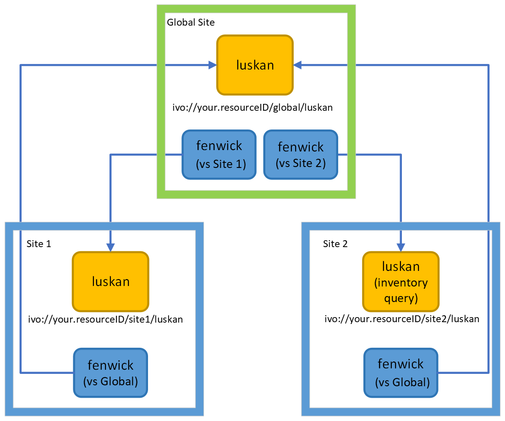

# Storage Inventory Operator Documentation

## Introduction
<!--This document is meant to guide you through a simple deployment of Storage Inventory site services and applications and  to introduce some of the concepts required.  Please also look at the development documentation -- [opencadc/storage-inventory](https://github.com/opencadc/storage-inventory), especially the [architecture description](https://github.com/opencadc/storage-inventory/tree/master/storage-inventory-dm).-->

## Basic Concepts
### Storage site

A _Storage site_ maintains an inventory of the files stored at a particular location, and provides mechanisms to access (minoc) those files  and query (luskan) the local inventory.  If you have files in multiple data centres, or more than one storage platform in one data centre (e.g. some files on a posix file-system and some on Ceph object storage), you would have _more than one Storage site, and each site would run its own services, database, storage, and applications_.   

  In the links below, example `docker-compose.yml` files are provided.  You may need to edit these files for your local site, after which you could run them with `docker-compose up -d`.

  1. **Proxy** - All interaction with _Storage site_ services needs to go through a [`proxy`](storage_site/proxy/README.md).  The proxy will provide SSL termination and will ensure that authentication headers are correctly set before connecting to the backend services.  The proxy will need a public IP address and a valid SSl certificate (e.g. [Let's Encrypt](https://www.letsencrypt.org)).  
  1. **Services** - A _Storage site_ runs two services:

      - [`minoc`](storage_site/minoc/README.md) - file service. Provides a file upload and download service.  
      - [`luskan`](storage_site/luskan/README.md) - metadata query service. Provides a service for querying the inventory database using the TAP protocol.
  
      Services are all containerized, with the service listening by default on port `8080` -- the example `docker-compose.yml` files given in the above links set different external ports for each service, which the proxy connects to.  

      Both `minoc` and `luskan` require access to the _Storage site's_ inventory database, but only `minoc` will require access to the _site's_ storage.

  1. **Resources** - A _Storage site_ will also need access to a database and a storage platform:

      - **Database** - The _Storage Inventory_ [`database`](storage_site/database/README.md) is the ledger tracking all the files storage at the site.  Applications and services will access this database in parallel so it will need to have good performance, especially as the content as the site grows.  
      - **Storage** - _Storage Inventory_ services currently work with two storage backends: [`POSIX file-systems`](https://github.com/opencadc/storage-inventory/tree/master/cadc-storage-adapter-fs) and [`object storage via the Swift API`](https://github.com/opencadc/storage-inventory/tree/master/cadc-storage-adapter-swift).  Example config files:
          - [`POSIX file-system adapter`](storage_site/minoc/config/cadc-storage-adapter-fs.properties)
          - [`Swift object storage adapter`](storage_site/minoc/config/cadc-storage-adapter-swift.properties)

  1. **Applications** - A _Storage site_ will also need to run applications to validate the inventory contents:
      - [`tantar`](storage_site/tantar/README.md) - file validation.  This compares the artifact metadata in the inventory database with the actual storage, ensuring that they are in sync.  
  
      Additional applications will be needed if the _Storage site_ is meant to be synced with other _Storage sites_, via a _Global site_.
      - [`fenwick`](storage_site/fenwick/README.md) - incremental metadata synchronization between the _Storage site_ and _Global site_.  Only compares artifacts since the last run.  
      - [`ratik`](storage_site/ratik/README.md) - full metadata validation between the _Storage site_ and _Global site_.
      - [`ringhold`](storage_site/ringhold/README.md) - artifact removal after a namespace/collection is removed from a site.
      - [`critwall`](storage_site/critwall/README.md) - file synchronization.  If metadata synchronization (`fenwick`, `ratik`) results in aritfacts in a site inventory without the associated files, critwall will negotiate the file transfers with the _Global site raven_ service.

### Global site

A _Global site_ maintains a view of the inventory of artifacts at all configured _Storage sites_.  _Storage sites_ do not know about other _Storage sites_: if two _Storage sites_ are meant to be kept in sync, they will query (via `fenwick` and `ratik`) the _Global site_ for files that they are missing.
  
1. **Proxy** - As with the _Storage site_ all interaction with _Global site_ services needs to go through a [`proxy`](global_site/proxy/README.md).  This proxy serves the same function as that for the _Storage site_, and could even be the same proxy but you'd need to ensure that the `resourceID` (explained elsewhere...???) for the _Storage site_ and _Global site_ resolve to different paths.

1. **Services** - A _Global site_ runs three services:
    - [`raven`](global_site/raven/README.md) - file transfer negotiation.  A request for a file through `raven` will not deliver the bytes of the file, but rather a redirect to the `minoc` service at a _Storage site_ that has the requested file.
    - [`luskan`](global_site/luskan/README.md) - inventory database query.  Same service as for the _Storage sites_, but for the global inventory.
    - [`baldur`](global_site/baldur/README.md) - file access authorization based on file namespace and authorization groups.  Not really a _Global site_ service, more like one of the ancillary services mentioned above.
      - If you only plan to have a single _Storage site_, and have no need of a _Global site_, you'll still need to deploy `baldur` if you want to grant authorization for users to upload or retrieve files.

1. **Database** - The _Global site_ [`database`](global_site/database/README.md) serves a similar but larger function than the _Storage site_ database: it tracks the artifacts that are at each _Storage site_, or that should be at each site.  Each _Storage site_ will query the _Global site_ to determine if new files have been uploaded to other sites.
1. **Applications** - A _Global site_ needs to run applicaitons to scan the inventory of remote _Storage sites_.

    - [`fenwick`](global_site/fenwick/README.md) - A _global site_ will need to run an instance of `fenwick` for _each_ site that it is monitoring.  These instances will scan the remote inventory (via that site's `luskan` service) and record in its own inventory what files have been added or removed. This acts as an incremental harvest of the site's artifact metadata.
    - [`ratik`](global_site/ratik/README.md) - As with `fenwick`, a _global site_ will run an instance of `ratik` for each site that it is monitoring, but it only will run these instances when it wants to do a full metadata validation between the remote storage and global site.

### Artifact Metadata sync between Global and Storage sites

### File sync between Storage sites

1. User (or telescope or remote process) PUTs a file to `Site 1` `minoc` service (not shown - Site 1 proxy,  query against `baldur` to determine write grants, storage or database interactions).
1. `Global site` fenwick discovers new file via a query to `Site 1` `luskan` service.
1. `Site 2` `fenwick` discovers new file via query to `Global site` `luskan` service.
1. `Site 2` `critwall` discovers artifact in `Site 2` inventory database, and negotiates a file transfer with `Global site` `raven` service.
1. `Site 2` `critwall` is redirect to `Site 1` `minoc` service which it downloads the file from.

### Artifact vs file
- an artifact is the entire body of metadata describing a data file.

### Site vs inventory
- yeah, sorry, these terms are often used interchangeably. Strictly speaking, though, inventory should refer to the artifacts in the inventory database. (_Storage site_ == _Storage Inventory_; _Global site_ == _Global inventory_)  

## Requirements
- Processing node requirements (where services and applications run)
  - docker-ce (20.10 or newer)
  - docker-compose (docker-compose file version 2.4 or newer)
    - docker-compose is really only required for the examples given here.  You can chose to orchestrate your services with other services (e.g. Swarm or Kubernetes).
  - haveged (or other entropy-generating service)
    - this is only necessary on hosts running the services.
  - _Storage Inventory_ services and applications don't consume a lot of memory (~1GB-4GB per instance) although some (minoc, tantar, critwall) are multithreaded and can take advantage of multiple cores.
  - In a production setting it would be best not to mix services and applications on the same nodes in order to ensure that service quality isn't affected by things like metadata validation.  A single node might suffice in a test deployment whereas you'll need several nodes for a production deployment.
- Database requirements
  - PG 12.3 or newer
  - storage: about 1KB/artifact (storage site) or 1.5KB/artifact (global site) for data and indices.
  - RAM/CPU:  For a site with 200 million artifacts, 20 cores with 180GB RAM and NVMe storage gives sufficient performance.
- Proxy
  - A proxy capable of doing SSL termination for backend services _and_ which can proxy x509 user proxy certificates (see the [proxy](storage_site/proxy/README.md) notes for more info about this...)

## General configuration notes
- services and applications expect all configuration files and credentials to be available in the container instance below the directory `/config`.
- config files are plain-text key-value files, with the key usually being of the form `org.opencadc.serviceName.keyName`
- configuration descriptions are provided on GitHub [opencadc/storage-inventory](https://github.com/opencadc/storage-inventory), with more detail in the sections in this document.

## A word about credentials
Services and applications use x509 proxy certificates for authorization and authentication.  
- *Applications* (critwall, fenwick, ratik, ringhold, tantar) will require credentials for a user that has
  been granted permissions to access files by a grant provider (e.g. baldur). This user doesn't make privileged calls and has no access to the actual storage or to other credentials.
- *Services* (baldur, luskan, minoc, raven) will require credentials that allow privileged operations on behalf of a user (e.g. minoc checking baldur if a particular user is allowed to download a file, baldur checking group membership against a group management service). Currently, this privileged account is one that needs to be recognized by the CADC services.
- services and applications both expect the above credentials to be provided as an x509 proxy certificate presented in the container instance as `/config/cadcproxy.pem`.  

# Common problems

- I'm sure that my service/application is configured with the correct inventory database url/username/password but it is failing to initialize.
  - check that the database `pg_hba.conf` file allows connections from the host that you're running the service on.  If you're running services in a docker swarm or a kubernetes cluster, the egress IP might not be obvious.
  - in the service configuration files, check that the configuration keys are correct.  For example, the key for the database url for the application `fenwick` is `org.opencadc.fenwick.inventory.url`; the key for the database url for the service `minoc` is `org.opencadc.minoc.inventory.url`.  It is easy to cut and paste between config files and forget to change the key.
