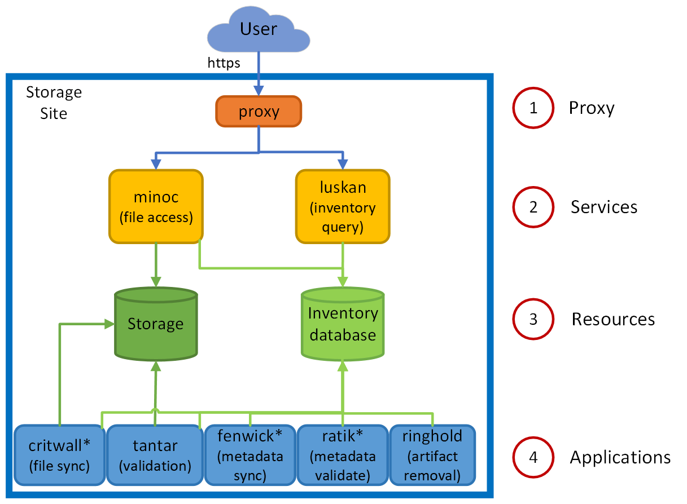
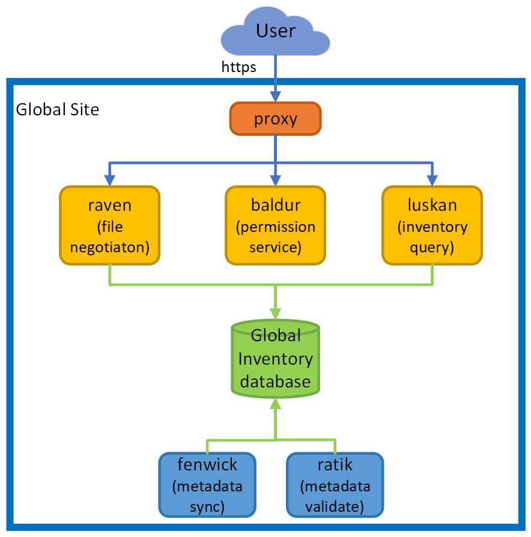
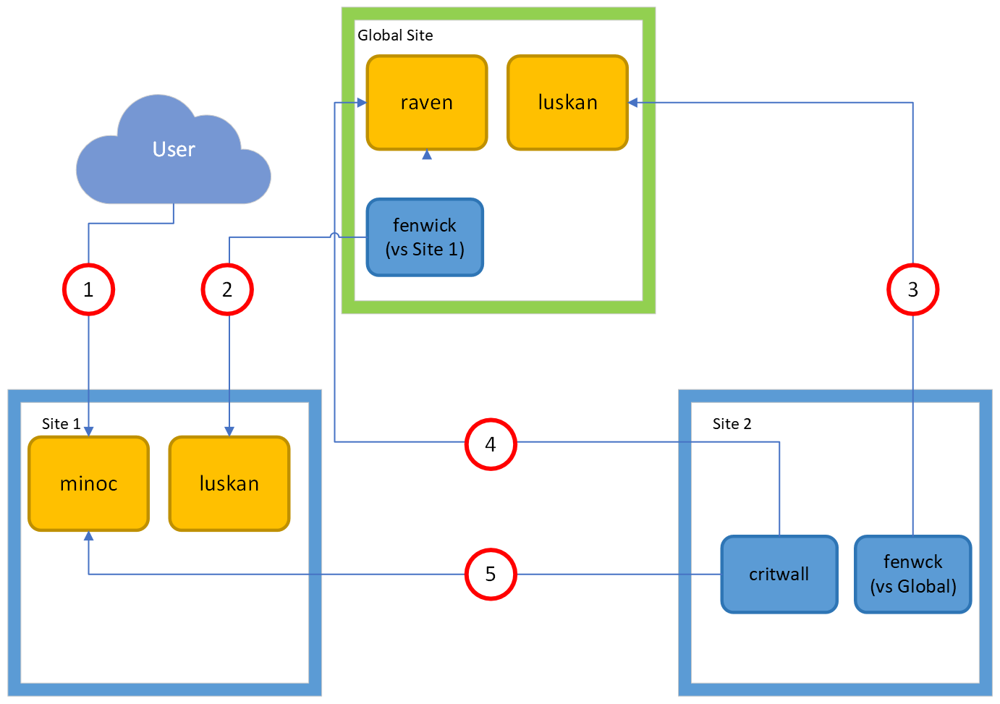

# CADC Storage Inventory Architecture and Deployment

The purpose of this document is to provide the user with a comprehensive guide for deploying the Storage Inventory (SI) 
system developed by the Canadian Astronomy Data Centre (CADC). The document covers all aspects of the deployment process,
including high level architecture, prerequisites, deployment steps, configuration and customization, management and 
monitoring, and maintenance and upgrades.

Read the entire document or jump to a relevant section below.

### Table of Contents

1. [Introduction](#introduction)
    * [Scope of the Document](#scope-of-the-document)
    * [Key Terms and Concepts](#key-terms-and-concepts)
    * [Target Audience](#target-audience)
    * [Document Conventions](#document-conventions)
2. [Overview of the System](#overview-of-the-system)
    * [System Architecture](#system-architecture)
    * [Key Components](#key-components)
    * [Communication between Components](#communication-between-components)
    * [System Workflow](#system-workflow)
3. [Deployment Prerequisites](#deployment-prerequisites)
    * [Hardware Requirements](#hardware-requirements)
    * [Software Requirements](#software-requirements)
    * [Network Configuration](#network-configuration)
    * [Security Considerations](#security-considerations)
4. [Deployment Process](#deployment-process)
    * [Deployment Steps](#deployment-steps)
    * [Deployment Scenarios](#deployment-scenarios)
    * [Deployment Best Practices](#deployment-best-practices)
    * [Common Deployment Issues and Troubleshooting](#common-deployment-issues-and-troubleshooting)
5. [Configuration and Customization](#configuration-and-customization)
    * [System Configuration](#system-configuration)
    * [Application Configuration](#application-configuration)
    * [Customizing System Behaviour](#customizing-system-behaviour)
    * [Customizing User Interfaces](#customizing-user-interfaces)
6. [Management and Monitoring](#management-and-monitoring)
    * [System Management](#system-management)
    * [Performance Monitoring](#performance-monitoring)
    * [Logging and Auditing](#logging-and-auditing)
    * [Alerts and Notifications](#alerts-and-notifications)
7. [Maintenance and Upgrades](#maintenance-and-upgrades)
    * [Updating the System](#updating-the-system)
    * [Backups and Disaster Recovery](#backups-and-disaster-recovery)
    * [System Maintenance and Optimization](#system-maintenance-and-optimization)
    * [Upgrading to New Versions](#upgrading-to-new-versions)
8. [Conclusion](#conclusion)
    * [Summary](#summary)
    * [Future Enhancements](#future-enhancements)
    * [Feedback and Support](#feedback-and-support)
9. [Appendices](#appendices)
    * [Glossary](#glossary)
    * [Deployment Scenarios](#deployment-scenarios-1)
    * [Troubleshooting Guide](#troubleshooting-guide)
    * [Contact Information](#contact-information)

## Introduction

### Scope of the Document
This document covers the deployment of the system in a production environment. The document assumes that the user has a basic understanding of container-based software systems, databases and web services. Dependinging on the
specific configuration, knowledge of Web authentication and authorization (A&A) might also be required.

### Key Terms and Concepts
Before proceeding with the deployment of the system, it is important to understand the following key terms and concepts:
- Containers: A lightweight and portable executable package that includes all the dependencies needed to run a software application.
- Distributed System: A system that consists of multiple, independent components that work together to provide a common goal.
- Web Services: A software system designed to support interoperable machine-to-machine interaction over a network.

**SI concepts**:
- **Artifact**: a representation of a file and its metadata in SI. File and artifact are used interchangebly through the document
- **resourceID/serviceID**: Unique ID in a URI form associated with a deployed service. Examples: `ivo://opencadc.org/minoc`

### Target Audience
This document is intended for system administrators and other technical users who are responsible for deploying, configuring, and maintaining the system.

### Document Conventions
Throughout the document, the following conventions will be used:
- Names of SI components are in **bold** font, key concepts are in _italic_ font, examples of values are in `code` font.
- Notes provide additional information that is relevant but not essential to understanding the main text.
- Warnings highlight important information that must be taken into consideration to prevent potential problems.

## Overview of the System

### System Architecture
The system is built on a distributed architecture that leverages the power of containerization to provide high availability, scalability, and resilience. The system consists 
of multiple nodes that run the Web services on top of various back end storage systems. Software applications are used to synchronize file data and metadata across 
the configured nodes.

A detailed description of the data model, features and limitations can be found [here](https://github.com/opencadc/storage-inventory/tree/master/docs)

### Key Components
SI can be be used for single or multiple sites. The multi-site configurations require a **global inventory** service with a view of all the sites. It is through this service that
the sites discover and synchronize their artifacts (files). With the exception of the actual storage, all the SI components are containerized.

#### Storage Site
A Storage site maintains an inventory of the files stored at a particular location, and provides mechanisms to access (minoc) those files and query (luskan) the local inventory. 
If you have files in multiple data centres, or more than one storage platform in one data centre (e.g. some files on a posix file-system and some on Ceph object storage), you would 
have more than one Storage site, and each site would run its own services, database, storage, and applications.

An SI site represents a local storage location associated with a storage.
- Front-end Web services:
    - [`minoc`](https://ws-cadc.canfar.net/minoc/): REST based file service that supports HEAD, GET, PUT, POST, DELETE operations.
    - [`luskan`](https://ws-cadc.canfar.net/luskan/): Web Service used to query artifact metadata using the [`IVOA Table Access Protocol`](https://www.ivoa.net/documents/TAP/)
- Resources:
    - **Inventory database**: is the ledger tracking all the files storage at the site. Applications and services will access this database in parallel so it will need to have good performance, 
especially as the content as the site grows.
    - **Storage platform**: the actual back end storage platform. Currently, SI supports two backends: POSIX filesystem and the Swift Object Store API (e.g. CEPH Object Store)
- Applications that run at a storage site:
    - **tantar**: file-validate application that compares the inventory database against the back end storage.
    - **critwall**: file-sync application that downloads files from peer sites.
    - **fenwick**: metadata-sync process between the site and global inventory.
    - **ratik**: metadata-validate application between the global inventory and the site.
    - **ringhold**: part of the metadata-validate process that cleans up after a change in local artifact selection policy, i.e. artifact removal after a namespace/collection is removed from a site.
   Note that single site configuration only requires the **tantar** application. The other applications are used in multi-site configurations and communiate with the global inventory.

#### Global Inventory
Global Inventory (GI) maintains a view of the inventory of artifacts at all configured Storage sites. It doesn't store any files. Peer sites do not know about each other: if sites are meant to be kept
in sync, they will query (via **fenwick** and **ratik**) the GI for files that they are missing.

GI consists of following components:
- Front-end Web services:
   - [`raven`](https://ws.cadc-ccda.hia-iha.nrc-cnrc.gc.ca/raven/): global locator service that supports transfer negotiation and direct file HEAD and GET requests. A request for a file through raven will 
     not deliver the bytes of the file, but rather a redirect to the minoc service at a Storage site that has the requested file.
   - [`luskan`](https://ws.cadc-ccda.hia-iha.nrc-cnrc.gc.ca/luskan/): Web Service used to query artifact metadata in GI using the [`IVOA Table Access Protocol`](https://www.ivoa.net/documents/TAP/)
- Resources:
   - **Inventory database**: serves a similar but larger function than the Storage site database: it tracks the artifacts that are at each Storage site, or that should be at each site.
     Each Storage site will query the Global site to determine if new files have been uploaded to other sites.
- Applications that run at a storage site:
   - **fenwick**: metadata-sync process between global inventory and sites.
   - **ratik**: metadata-validate application between the global inventory and sites.
   
#### Infrastructure Services
The following Web services are required but their functionality is very basic and might be achieved through other mechanisms: 
   - **proxy**: All the calls the front-end Web services need to go through a proxy that provides SSL termination and ensures that authentication 
     headers are correctly set before being routed to the actual service. The proxy needs a public IP address and a valid SSl certificate (e.g. [Let's Encrypt](https://www.letsencrypt.org)).
   - [`registry`](https://ws.cadc-ccda.hia-iha.nrc-cnrc.gc.ca/reg/): Used to map service IDs to the actual URLs where the service is deployed decoupling the service from its actual location. The simplest **registry** is a static page but the **reg** container
     included with the SI distribution allows the information to be configured on the fly.
   - [`baldur`](https://ws.cadc-ccda.hia-iha.nrc-cnrc.gc.ca/baldur): permissions service API using configurable rules to grant access based on resource identifiers (Artifact.uri values in the inventory data model).
     his service is required if Authentication and Authorization (A&A) is required for the SI deployment.
     
#### Client Software
Generic HTTP client tools such as [`curl`](https://curl.se) or [`wget`](https://www.gnu.org/software/wget/) can be used to interact with the SI, however multi-step operations such as transfer negotiations or transfer of large files with
SI transactions might require dedicated scripts.

Alternatively, the CADC maintains Python client applications/libraries that can be used with the SI:
   - [`cadcdata`](https://pypi.org/project/cadcdata/) - for file operations with **minoc** and **raven**. That includes transfer negotiations, file uploads, downloads or deletes. Or simply file information. The package takes advantage of
     the SI features to offer robust and fault tollerant transfer of files small or large.
   - [`cadctap`](https://pypi.org/project/cadctap/) - for querying the artifact metadata. It works with a **luskan** service delopyed at a site or the global one. Alternatively, any generic TAP-based tool can be used to query **luskan** including (but not limitted to) [`PyVO`](https://pypi.org/project/pyvo/)

The [`CADC Direct Data Service`](https://www.cadc-ccda.hia-iha.nrc-cnrc.gc.ca/en/doc/data/) describes a lot of scenarios for accessing the CADC SI using generic and specific client tools. 

### Communication between Components
The components of the system communicate with each other over a network using well-established communication protocols such as HTTP and REST. **luskan** queries to inventory database service use the [`IVOA TAP Protocol`](https://www.ivoa.net/documents/TAP/)

Subject to A&A rules specific to each deployment, the Front-End Web services need to be otherwise accessible to applications running at `Global` or any of the sites.

### System Workflow
Workflows below are for a distributed SI with two sites `Site1` and `Site2` but it applies to an arbitrary number of sites. SI relies on eventual consistency for synchronizing the data across the sites and that means that there is a delay for changes at a site
to propagate to `Global` and the other site.

1. User (or telescope or remote process) PUTs a file to `Site1`.
   This can be achieved either by negotiating a transfer with **raven** at `Global` that returns a URL to the `Site1` **minoc** where to do the PUT or by calling `Site1` **minoc** directly. If successfull, the file exists initially only
   at `Site1`. Neither `Global` nor `Site2` knows anything about the file until the next step in the sequence. 
2. `Global` **fenwick** discovers new file via a query to `Site1` **luskan** service.
   `raven` now knows that the file exists at `Site1` and can GET transfer negotiations will return the `Site1` **minoc** URL where the file is available from
3. `Site2` **fenwick** discovers the new file via query to `Global` **luskan** service.
    End user will see no change except that the artifact is now available in `Site2` **luskan**. 
4. `Site2` **critwall** discovers artifact in `Site2` inventory database, and negotiates a file transfer with `Global` `raven` service and downloads the file from `Site1` **minoc**.
   End user can now download the file directly from `Site1` or `Site2` however `Global` is still not aware that the file exists at `Site2` and
   will not include it in transfer negotiation results.
5. `Global` **fenwick** discovers the new file available at `Site2`
   The system is now consistent WRT of the new file. URLs to both `Site1` and `Site2` are included in the **raven** transfer negotiation results.
   
The above workflow also applies to file updates or deletes. The system handle concurrent operations on a file at multiple sites.

## Deployment Prerequisites

### Hardware Requirements

### Software Requirements
The software requirements for deploying the system are:
#### Processing node requirements (where services and applications run)
Storage Inventory services and applications don't consume a lot of memory (~1GB-4GB per instance) although some (minoc, tantar, critwall) are multithreaded and can take advantage of multiple cores.
In a production setting it would be best not to mix services and applications on the same nodes in order to ensure that service quality isn't affected by things like metadata validation. A single node might suffice in a test deployment whereas you'll need several nodes for a production deployment.
   - docker-ce (20.10 or newer)
   - orchestration software: docker-compose (docker-compose file version 2.4 or newer), Swarm or Kubernetes). 
   - [`haveged`](https://www.issihosts.com/haveged/) (or other entropy-generating service) this is only necessary on hosts running the services. 
     
#### Database requirements
 - PG 12.3 or newer 
 - storage: about 1KB/artifact (storage site) or 1.5KB/artifact (global site) for data and indices.
 - RAM/CPU: For a site with 200 million artifacts, 20 cores with 180GB RAM and NVMe storage gives sufficient performance.
     
### Network Configuration
The system requires a stable network connection with low latency and high bandwidth to function properly. It is important to configure the network in accordance with best practices for security and performance.

### Security Considerations
The system must be deployed in a secure environment that protects against unauthorized access and data breaches. The following security measures must be taken into consideration:
- Firewall configuration to restrict access to the system from unauthorized sources.
- Secure communication between components using encryption technologies such as SSL/TLS.
- Regular security patching and updates to the operating system and software components.
- Access control and authentication mechanisms to control who can access the system and what they can do.

## Deployment Steps

### Step 1: Install the Required Software
To deploy the system, you must first install the required software, including the operating system, Docker, and Docker Compose.

### Step 2: Configure the Network
Next, you must configure the network to ensure that the system components can communicate with each other and the outside world.

### Step 3: Deploy the System Components
After the required software and network are in place, you can deploy the system components using Docker Compose. The process involves defining the desired state of the system in a `docker-compose.yml` file and then using the `docker-compose up` command to bring the components online.

### Step 4: Verify the Deployment
After the deployment is complete, you can verify that the system is functioning as expected by accessing the front-end web server and interacting with the system.

## Configuration and Customization

Services and applications expect all configuration files and credentials to be available in the container instance below the directory `/config`. Config files are plain-text key-value files, 
with the key usually being of the form org.opencadc.serviceName.keyName configuration descriptions. Details for each service/application:

Web Services:
- [`minoc`](https://github.com/opencadc/storage-inventory/tree/master/minoc)
- [`raven`](https://github.com/opencadc/storage-inventory/tree/master/raven)
- [`luskan`](https://github.com/opencadc/storage-inventory/tree/master/luskan)
- [`baldur`](https://github.com/opencadc/storage-inventory/tree/master/baldur)
- [`registry`](https://github.com/opencadc/reg/tree/master/cadc-registry)
- [`haproxy`](https://github.com/opencadc/docker-base/tree/master/cadc-haproxy-dev)

Applications:
- [`critwall`](https://github.com/opencadc/storage-inventory/tree/master/critwall)
- [`fenwick`](https://github.com/opencadc/storage-inventory/tree/master/fenwick)
- [`ratik`](https://github.com/opencadc/storage-inventory/tree/master/ratik)
- [`ringhold`](https://github.com/opencadc/storage-inventory/tree/master/ringhold)
- [`tantar`](https://github.com/opencadc/storage-inventory/tree/master/tantar)

## A word about credentials
Services and applications use x509 proxy certificates for authorization and authentication.
- Applications (**critwall**, **fenwick**, **ratik**, **ringhold**, **tantar**) will require credentials for a user that has
  been granted permissions to access files by a grant provider (e.g. **baldur**). This user doesn't make privileged calls and has no access to the actual storage or to other credentials.
- Services (**baldur**, **luskan**, **minoc**, **raven**) will require credentials that allow privileged operations on behalf of a user (e.g. minoc checking baldur if a particular user is allowed to download a file, baldur checking group membership against a group management service). Currently, this privileged account is one that needs to be recognized by the CADC services.
- services and applications both expect the above credentials to be provided as an x509 proxy certificate presented in the container instance as `/config/cadcproxy.pem`.

### Management and Monitoring
The system must be managed and monitored to ensure that it is running smoothly and efficiently. The following tools and techniques can be used to manage and monitor the system:

- Docker Compose: Docker Compose can be used to manage the system's components and perform common tasks, such as starting and stopping the system, checking the status of the system, and updating the system.
- Logs: The system generates logs that can be used to monitor its performance and diagnose problems. The logs can be accessed using the Docker Compose command.
- Metrics: The system exposes various metrics that can be used to monitor its performance, such as CPU and memory usage, network traffic, and system load. The metrics can be accessed using tools such as Prometheus and Grafana.
- Alerts: Alerts can be configured to notify the administrator if the system encounters problems, such as high CPU or memory usage, or if the system stops responding. The alerts can be configured using tools such as Prometheus Alert Manager.

## Maintenance and Upgrades

The system must be regularly maintained and upgraded to ensure that it continues to function smoothly and efficiently. The following tasks should be performed on a regular basis to maintain the system:

- Software updates: Regular software updates must be installed to address known vulnerabilities and prevent potential security breaches.
- Backups: Regular backups of the system's data must be taken to prevent data loss in case of hardware failures or other problems.
- System tuning: The system's performance should be regularly monitored and tuned to ensure that it is running efficiently.

## Conclusion

### Summary

In this document, we have described the deployment process for a distributed container-based web services software system. We have covered the key components of the system, deployment prerequisites, deployment process, configuration and customization, management and monitoring, and maintenance and upgrades.

### Future Enhancements

There is always room for improvement and future enhancements in any system. Some potential areas for future enhancements in this system could be:

- Adding new features to meet changing user requirements
- Improving performance and scalability of the system
- Adding more robust security features

### Feedback and Support

We hope that this document has provided you with a comprehensive understanding of the deployment process for the system. If you have any feedback or questions, please feel free to reach out to the support team.

## Appendices

### Glossary

This section provides definitions for key terms and concepts used throughout the document.

### Deployment Scenarios

This section provides detailed information on various deployment scenarios, including typical use cases, hardware requirements, and deployment steps.

### Troubleshooting Guide
I'm sure that my service/application is configured with the correct inventory database url/username/password but it is failing to initialize.
check that the database pg_hba.conf file allows connections from the host that you're running the service on. If you're running services in a docker swarm or a kubernetes cluster, the egress IP might not be obvious.
in the service configuration files, check that the configuration keys are correct. For example, the key for the database url for the application fenwick is org.opencadc.fenwick.inventory.url; the key for the database URL
for the service minoc is org.opencadc.minoc.inventory.url. It is easy to cut and paste between config files and forget to change the key.

This section provides a step-by-step guide to troubleshoot common issues that may arise during deployment.

Additional FAQ can be found [`here`](https://github.com/opencadc/storage-inventory/blob/master/docs/FAQ.md)

### Contact Information

This section provides the contact information for the support team, including email and phone numbers, as well as links to online resources for getting help and support.

